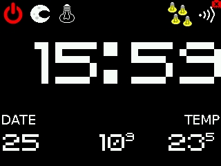

# Custom Chumby Frontend

## Introduction

The Chumby, released in 2007, was an innovative but ultimately short-lived internet-connected device. Here's a breakdown of its key technical aspects:

**Hardware:**

* **Processor:** Samsung S3C2440 ARM9 Processor (266 MHz)
* **Memory:** 64MB RAM, 256MB flash memory 
* **Display:** 2.2-inch Touch TFT LCD (320 x 240 resolution)
* **Connectivity:** Wi-Fi 802.11b/g (via internal usb wifi dongle)
* **Audio:** Built-in speaker and microphone
* **Input:** SD card slot, two USB ports, power button, one big button on the top, scrollwheel on the side.
* **Other:** Built-in clock, accellerometer

**Software:**

* **Operating System:** Linux-based custom operating system
* **Applications:** Flash based widgets provided access to news, weather, games, photos, music, and more.
* **Development:**  Open platform for developers to create custom widgets and applications.

**Additional details:**

* **Power:** AC adapter
* **Size:**  4.6 x 3.2 x 2.4 inches
* **Weight:** 10.5 ounces

The Chumby aimed to be a user-friendly and customizable device. It relied on widgets, mini-applications that displayed various information or performed specific tasks. Users could access pre-made widgets or create their own, thanks to the open platform.

While the Chumby offered innovative features for its time, it faced challenges like limited processing power and storage space. Additionally, the market for connected devices evolved quickly, and the Chumby ultimately couldn't keep up. 

It's important to note that while Chumby ceased operations, the devices remain functional for enthusiasts who utilize alternative software and online resources.

## The Project

Now that you know what the chumby ~~was~~is let's see how can we make it useful again. My information below is specifically about the Chumby One model but will likely apply to other models with minor modifications.

### Enabling the robot mode

The original authors of the Chumby foresaw it as a great platfrom for robotis (aka it could be the brian of a robot) therefore they created a rather easy way to disable the built in flash UI and run custom apps on the bare Linux distro underneath.

I have uploaded [this great tutorial](docs/ChymbyAsARobot.pdf) by Bob Smith who was one of the poeple involved with the original development of the Chumby and was kind enough to dump some very useful resources around the Chumby which would be likely 
impossible to come by anymore and which I am going to add to this repo for posterity but claim no ownership or affiliation.

### Hacking for the Chumby

Once you have enabled SSH and stopped the usual frontend from running it's time to figure out how to build something of ourselves. 

I personally started this project a few years ago on KDevelop under Linux but recently have been using VSCode. You need to use a toolchain for the arm platfrorm either by compiling direcly on the Chumby (very very slow) or cross-compile on your computer. 
I have tried to also remote-debug with gdb the app on the Chumby but never really managed to get gdb-server to run reliably there. 
The toolchains I used are the GCC C/C++ compilers for ARM and for cross-compilation on x86 but I have also a python 2.6 interpreter and some ancient JVM 1.7 instance for the Chumby.

At this point it is useful to compile a minimal "hello world" app to make sure your toolchain works as expected.

### Let's get more concrete

Here is the set of functions I have built in my new Chumby Frontend that I use as a nightstand clock (one on each side of the bed) and smart home interface every day:
* **Display**
  * **The Main Screen** - Shows the time and date, wifi connection status, inside/outside temperature, a bunch of buttons to switch modes and control things.
    
    
  * **The Radio Screen** - This allows to play/stop one of four preset online streams.
  * **The Lights Screen** - Allows me to turn on/off any light in my home.
  * **Calibration Screen** - Hidden screen to re-calibrate the touchscreen matrix.
  * **Game Screen** - Never finished flappy bird clone that was supposed to feature mario-water-level themed game.
* **The Main Button**
  * The button can be clicked, double-, tripple- and even quadrupple-clicked to achieve quick actions. Here is my current setup
  * **Single** - Toggle reading light on/off.
  * **Double** - Toggle cealing light on/off.
  * **Tripple** - Toggle other-side of bed reading light on/off
  * **Quadrupple** - Turn off all lights in the home.
  * On the radio screen it is stop/play the last radio station.
* **The scrollwheel**
  * On the main screen it controls the brightness of the screen.
  * On the radio screen it controls the volume.
* **The accellerometer** aka the tilt sensor
  * On any screen it controls the window blinds in a similar way to a car-window button.
  * **Tilt down the screen and set back quickly** - Close the blinds all the way if not moving or stop the blinds if moving.
  * **Tilt up the screen and set back quickly** - Open  the blinds all the way if not moving or stop the blinds if moving.
  * **Tilt down the screen and keep tilted** - Start closing the blinds but stop as soon as released.
  * **Tilt up the screen and keep tilted** - Start opening the blinds but stop as soon as released.
* **The microphone**
  * Never really had the time to implement integration with some assistant feature but at some point I had an option to use the mic/speaker as a way to talk with the person in the room over the internet but it was clumsy and manual.
 

### A few implementation details

The screen is a represented by a linear frame buffer file that you can write to directly. The screen drawing library implemens double buffering and offers a bunch of drawing functions for sprites and primitives that are running quite smoothly in the device and are optimized to use as little memory as possible given the fact that we have only 64MB.

The buttons, touchscreen and scrollwheel are mapped to regular HID events so they can be tapped into pretty easily.

The accellerometer needs to be polled so I do this in a separate thread with 20Hz which is enough for my needs and then dispatch the current readings through my Event Queue.

I wrote my own tiny http library which supports basic GET/POST requests and is enough to communicate with the home automation endpoints in the home to fetch current temperatures, lights status and send commands.

For the internet radio I use the preinstalled bplay app on the Chumby.

I used to have an air quiality sensor in the bedroom with a light sensor so the screen would dim and brighten on its own but I had to move it elsewere so now I need to use the scrollwheen if I want to change the brightness.

Most commands are very custom my home automation dispatcher I wrote before I started using Home Assistant but it should be strightforward to change to whatever you use in you house.

